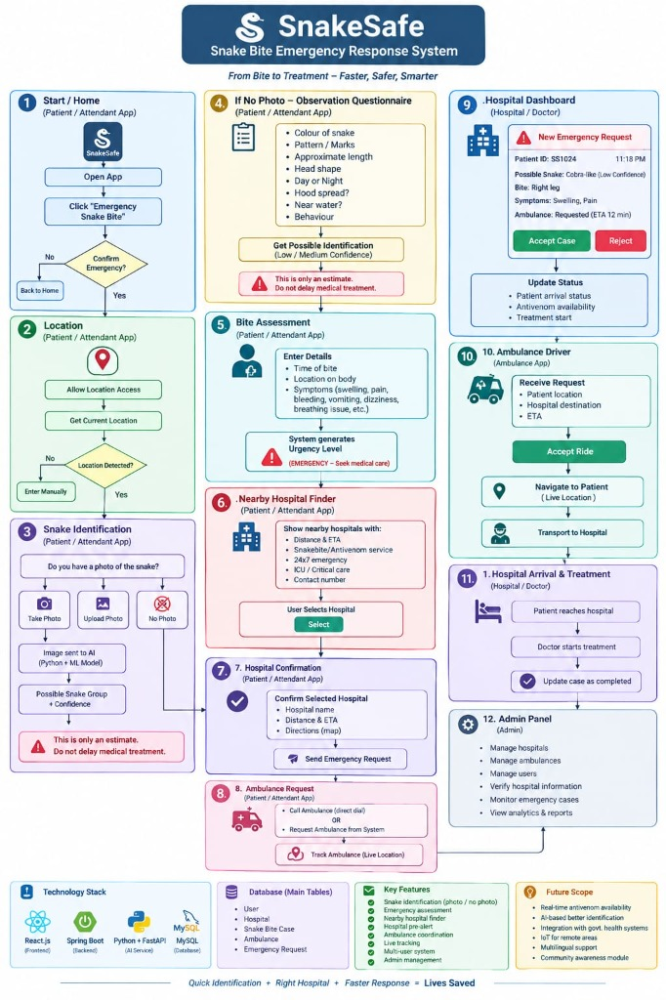
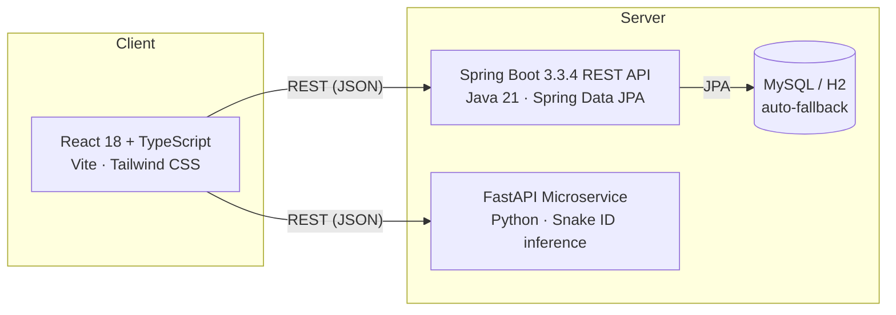

<div align="center">

# 🐍 SnakeSafe
### Snake Bite Emergency Response System

*"From Bite to Treatment — Faster, Safer, Smarter"*

[](https://react.dev/)
[](https://www.typescriptlang.org/)
[](https://spring.io/projects/spring-boot)
[](https://openjdk.org/)
[](https://fastapi.tiangolo.com/)
[](LICENSE)

[Overview](#overview) • [Demo Flow](#demo-flow) • [Architecture](#architecture) • [Getting Started](#getting-started) • [Tech Stack](#tech-stack) • [Roadmap](#roadmap--limitations)

</div>

---

## Overview

**SnakeSafe** is a full-stack prototype exploring a single question: *can a guided digital workflow meaningfully reduce the coordination chaos of a snakebite emergency?*

In India, snakebite is one of the leading causes of preventable death — and the real-world response today is almost entirely manual: an untrained bystander has to guess the species, guess the severity, find a capable hospital, and arrange transport, all without support. SnakeSafe replaces those four separate guesses with **one connected flow**, built end-to-end across four synchronized user roles — Patient, Hospital Doctor, Ambulance Driver, and System Admin.

It was designed against a 12-step emergency flowchart (below) and implemented as a three-service full-stack system: a React frontend, a Spring Boot REST API, and a Python FastAPI microservice for snake identification.

> **Project status:** working prototype — all 12 flowchart screens are implemented and functional end-to-end. See [Roadmap & Limitations](#roadmap--limitations) for an honest breakdown of what's real logic vs. simulated for demo purposes.

<div align="center">

</div>

---

## Demo Flow

The app ships with a floating **Quick Role Bar** so a single person can demo all four perspectives on one laptop without needing four devices:

| Role | Who | What they see |
|---|---|---|
| 🔴 Patient / Attendant | — | Emergency trigger → location → snake ID → bite assessment → hospital finder → ambulance |
| 🔵 Hospital Doctor | Dr. Ananya Roy | Incoming case queue, Accept/Reject triage, clinical treatment sequence |
| 🟢 Ambulance Driver | Vikram Singh | Dispatch requests, live milestone tracker (Accepted → Hospital Arrival) |
| 🟣 System Admin | Dr. Meera Patel | Hospitals, ambulance fleet, users, case analytics |

A single case flows through all four views in real time — confirming a hospital as the Patient immediately surfaces that case on the Doctor's dashboard, and so on.

### The 12 implemented screens

1. **Home** — emergency trigger with a confirmation safety modal
2. **Location** — GPS auto-detect with manual fallback
3. **Snake Identification** — photo upload/capture *or* skip to the questionnaire
4. **Observation Questionnaire** — 8-point clinical scoring (colour, pattern, length, head shape, time of day, hood spread, water proximity, behaviour)
5. **Bite Assessment** — body-map location picker + symptom checklist → urgency classification
6. **Nearby Hospital Finder** — distance/ETA-ranked list with capability badges (Antivenom Stocked, ICU, 24×7)
7. **Hospital Confirmation** — generates a trackable Case ID (e.g. `SS1024`)
8. **Ambulance Coordination** — 108 helpline hand-off or in-app ALS dispatch with live tracking
9. **Hospital / Doctor Dashboard** — real-time case queue with Accept/Reject
10. **Ambulance Driver Cockpit** — status milestones from Accepted to Hospital Arrival
11. **Clinical Treatment View** — bite timeline, symptoms, treatment sequence
12. **Admin Console** — hospitals, fleets, users, case analytics

---

## Architecture



**Why three services instead of one app:** clean separation of concerns. The frontend owns nothing but presentation. The Spring Boot API owns all persistent state — cases, hospitals, ambulances, users — behind a REST interface. The identification logic is fully isolated in its own service, so it can be retrained or replaced later (e.g. swapped for a real trained vision model) without touching the frontend or backend at all.

The backend defaults to an **in-memory H2 database** with zero setup, and transparently switches to MySQL when `DB_URL` is provided (see [Environment Variables](#environment-variables)) — useful for local development vs. a Docker/production-style run.

---

## Getting Started

### Prerequisites
| Tool | Version |
|---|---|
| Java (JDK) | 21+ |
| Maven | 3.9+ |
| Node.js | 18+ |
| Python | 3.10+ |

### 1. Clone and enter the project
```bash
git clone https://github.com/<your-username>/snakesafe.git
cd snakesafe
```

### 2. One-time dependency install (per service)
```bash
cd backend && mvn dependency:go-offline && cd ..
cd frontend && npm install && cd ..
cd ai-service && pip install -r requirements.txt && cd ..
```

### 3. Run everything
**macOS / Linux:**
```bash
./start-all.sh
```
**Windows:**
```bat
run-snakesafe.bat
```

This launches all three services and opens the app automatically:

| Service | URL |
|---|---|
| Frontend | http://localhost:5173 |
| Backend REST API | http://localhost:8080 |
| AI Service | http://localhost:8000 |
| Health check | http://localhost:8080/api/health |

No database setup is required for local development — it runs on an in-memory H2 database out of the box.

### Alternative: Docker Compose
```bash
docker-compose up
```
Spins up all three services plus a real MySQL database container.

---

## Environment Variables

The backend accepts the following overrides (all optional — sensible defaults are used for local dev):

| Variable | Default | Purpose |
|---|---|---|
| `DB_URL` | in-memory H2 | JDBC URL — set to a MySQL URL for persistent storage |
| `DB_USER` / `DB_PASSWORD` | `sa` / *(empty)* | Database credentials |
| `DB_DRIVER` | `org.h2.Driver` | JDBC driver class |
| `DB_DIALECT` | `org.hibernate.dialect.H2Dialect` | Hibernate dialect — set to `org.hibernate.dialect.MySQLDialect` for MySQL |
| `AI_SERVICE_URL` | `http://localhost:8000` | Base URL the backend uses to reach the AI microservice |

See `.env.example` in each service folder for a ready-to-copy template.

---

## Tech Stack

**Frontend** — React 18 · TypeScript · Vite · Tailwind CSS · React Router 6 · lucide-react

**Backend** — Spring Boot 3.3.4 (Java 21) · Spring Data JPA · MySQL (prod) / H2 (dev) · Maven

**AI Service** — Python · FastAPI · Pillow

---

## Roadmap & Limitations

Being upfront about this, on purpose — it's a prototype, and pretending otherwise helps no one:

- **Snake identification is a two-path system.** The clinical questionnaire path is a real weighted-scoring algorithm across all 8 indicators. The photo-upload path currently simulates what a trained computer-vision model would return, rather than running actual inference — the full pipeline (upload → confidence score → risk level → mandatory safety warning) is real and wired end-to-end, so swapping in a trained image classifier is a drop-in replacement, not a rebuild.
- **Hospital/ambulance directory is seed data**, not a live external feed — though the distance/ETA ranking on top of it runs a genuine haversine-based calculation from stored coordinates.
- **Auth is a demo stub** — `/api/auth/login` doesn't verify a password and issues a mock token. Real authentication (hashed passwords + signed JWTs) is on the roadmap.
- **No automated tests yet.**

Planned next:
- [ ] Replace mock auth with real password hashing + signed JWT
- [ ] Add unit/integration test coverage (backend + frontend)
- [ ] Train and integrate a real image-classification model for snake ID
- [ ] Connect to a live hospital inventory / 108 ambulance API
- [ ] CI pipeline (build + lint + test on push)

---

## Team

## Team

**Mohammad Saad** — Lead Developer · Backend, AI Service & Architecture
**Akil Siddiki** — Frontend & UX

Jahangirabad Institute of Technology
*Originally prototyped at a college tech fest with a third contributor (Kshitij Mishra); actively maintained by Saad & Akil going forward.*
Jahangirabad Institute of Technology

## License

Licensed under the [MIT License](LICENSE).
